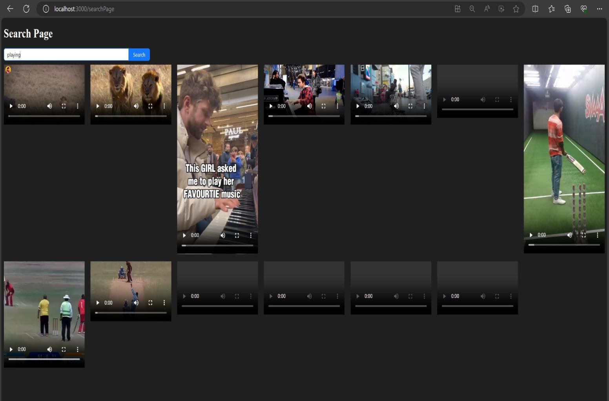

# Video Event Detection System

The **Video Event Detection System** is an AI-powered application designed to process video files, extract meaningful insights, and generate automated captions and summaries. This project combines computer vision, natural language processing (NLP), and a user-friendly web interface for seamless video event analysis.

## Table of Contents

- [Features](#features)
- [Technologies Used](#technologies-used)
- [Project Structure](#project-structure)
- [Setup Instructions](#setup-instructions)
  - [Backend Setup](#backend-setup)
  - [Frontend Setup](#frontend-setup)
- [Usage](#usage)
- [Screenshots](#screenshots)
- [Contributors](#contributors)

## Features

- **Video Upload:** Supports video uploads in various formats.
- **Frame Extraction:** Automatically extracts frames for analysis.
- **Text Summarization:** Generates concise summaries and titles for video content.
- **Search Functionality:** Allows keyword-based search to find relevant videos.
- **User-Friendly Interface:** Built with React for smooth navigation and interaction.

## Technologies Used

### Frontend
- React.js
- Ant Design (UI components)

### Backend
- Flask
- OpenCV (for frame extraction)
- Transformers (for text generation)
- OpenAI GPT (for summarization)

### Additional Tools
- TensorFlow
- PyTorch
- scikit-learn (for TF-IDF and search)

## Project Structure

```
Video-Event-Detection/
├── README.md                   # Project overview and instructions
├── .gitignore                  # Files and directories to ignore in Git
├── requirements.txt            # Python dependencies
├── LICENSE                     # License information (if applicable)
├── frontend/                   # Frontend code
│   ├── public/                 # Static files (HTML, CSS, assets)
│   ├── src/                    # Source code
│   │   ├── components/         # React components
│   │   │   ├── UploadPage.js
│   │   │   ├── SearchPage.js
│   │   ├── styles/             # CSS files
│   │   ├── App.js
│   │   ├── index.js
│   ├── package.json            # Node.js dependencies for the frontend
│   ├── package-lock.json       # Lock file for Node.js dependencies
├── backend/                    # Backend code
│   ├── app.py                  # Main Flask application
│   ├── video_split.py          # Frame extraction logic
│   ├── text_generate.py        # Text generation logic
│   ├── store_captions.py       # Captions management
│   ├── summary.py              # Summarization logic
│   ├── tfidf.py                # Search functionality
│   ├── requirements.txt        # Backend Python dependencies
│   ├── models/                 # Pretrained models (if applicable)
│   ├── uploads/                # Directory for uploaded videos
│   ├── output_frames/          # Extracted frames
│   ├── output.json             # Captions and metadata
├── docs/                       # Documentation
│   ├── Video-Event-Detection.pdf # Software requirements specification
│   ├── images/                 # Screenshots and diagrams for documentation
│   │   ├── GanttChart.png
│   │   ├── PERTChart.png
│   │   ├── UseCaseDiagram.png
│   │   ├── SystemDesign.png
│   │   ├── ClassDiagram.png
├── tests/                      # Test cases and scripts
│   ├── functional_tests/
│   │   ├── upload_test.py
│   │   ├── search_test.py
│   │   ├── summarization_test.py
│   ├── performance_tests/
│       ├── response_time_test.py
```

## Setup Instructions

### Backend Setup
1. Clone the repository:
   ```bash
   git clone https://github.com/anna123venkat/Video-Event-Captioning.git
   cd Video-Event-Detection/backend
   ```
2. Create a virtual environment and install dependencies:
   ```bash
   python -m venv venv
   source venv/bin/activate  # On Windows: venv\Scripts\activate
   pip install -r requirements.txt
   ```
3. Run the Flask server:
   ```bash
   python app.py
   ```

### Frontend Setup
1. Navigate to the frontend directory:
   ```bash
   cd Video-Event-Detection/frontend
   ```
2. Install dependencies:
   ```bash
   npm install
   ```
3. Start the React development server:
   ```bash
   npm start
   ```

### Additional Notes
- Ensure that the backend server is running before using the frontend.
- Update the backend API URLs in the React app if required.

## Usage

1. Upload a video file through the web interface.
2. Wait for the system to process the video and generate captions.
3. View the generated summary and captions on the interface.
4. Use the search functionality to find previously uploaded videos.

## Screenshots

### Upload Video


### Generated Captions


### Search Videos

